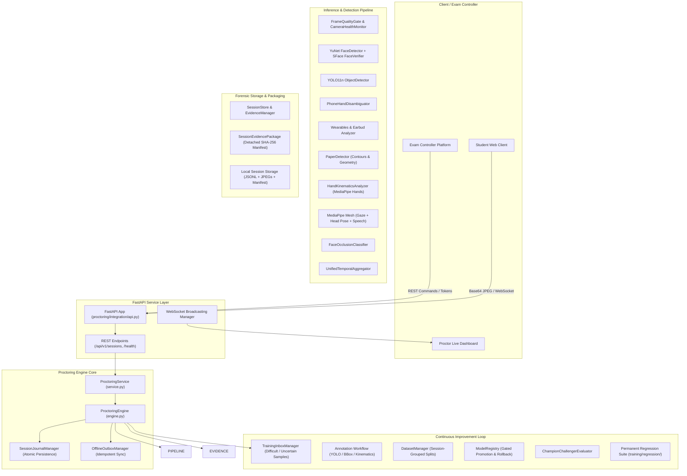
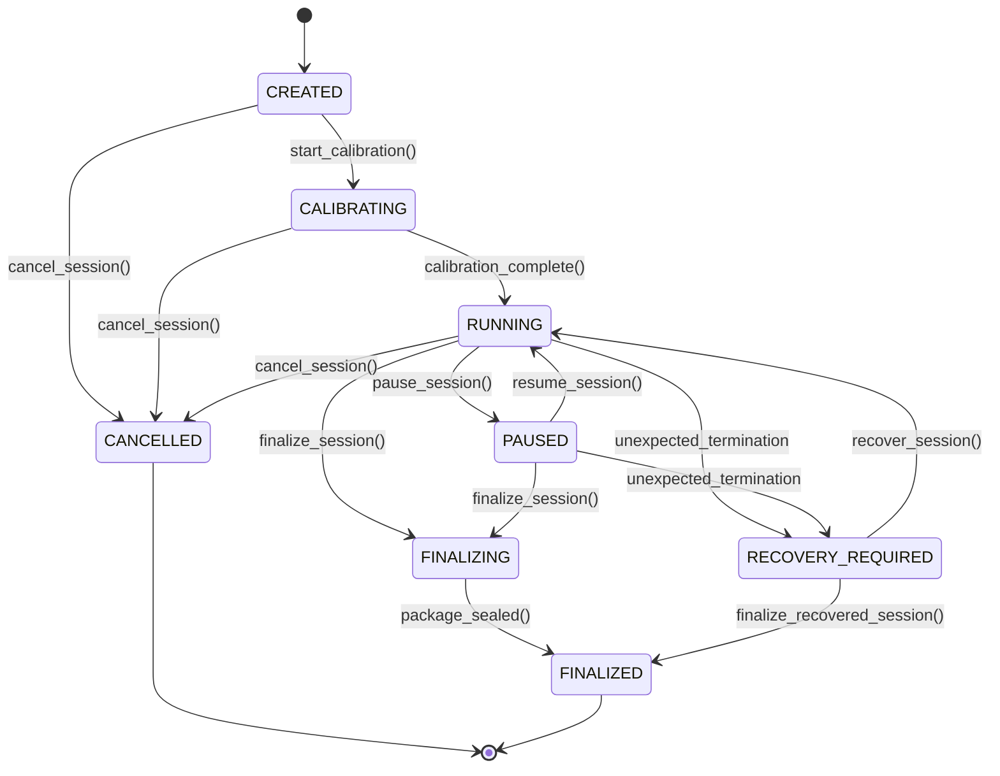

# AI Proctoring Engine — Authoritative Project State & Architecture Specification

```yaml
project: AI Proctoring Engine
document: project_state.md
state_version: 2.0
last_audited: 2026-09-08
audit_type: production_readiness_audit
audited_by: principal_software_ml_engineer
base_commit: 967e9ae53b6167f244f2b4ebaa311788384e4394
git_branch: main
working_tree_status: active_features_integrated
test_suite_status: 397 passed, 1 skipped, 0 failed (398 collected)
```

---

## 1. Project Identity & Purpose

The **AI Proctoring Engine** is an in-house computer vision and telemetry verification engine designed for integration with a university-owned **Exam Controller** platform.

### Core Mission & Ethical Principles
1. **Human-in-the-Loop Mandate**: The AI engine **never makes automated cheating verdicts**, student sanctions, or disqualifications. It strictly acts as an evidentiary and forensic assistant that outputs structured observations, qualified incidents, review keyframes, and diagnostic telemetry. A human proctor/invigilator remains the sole authority for evaluating student intent.
2. **No Opaque Risk Scores**: The system rejects cumulative suspicion scores, cheating probabilities, or black-box risk algorithms.
3. **Equipment Fault Invariant**: Hardware, network, and model failures (`TECHNICAL_DIAGNOSTIC`) are strictly separated from candidate-related behaviors (`CANDIDATE_OBSERVATION`). A camera disconnection or inference drop is never transformed into candidate suspicion.
4. **Authoritative & Durable State**: Mid-session state is atomically persisted to disk via an append-only journal and state checkpoints, ensuring resilience against power failure, process termination, and network outages.
5. **Offline-First Resilience**: Sessions continue uninterrupted during local network disconnects; events and evidence queue into an offline outbox and synchronize idempotently when connectivity resumes.
6. **Controlled Continuous Learning**: No uncontrolled self-training. Runtime failure cases feed into a human-annotated inbox, versioned datasets, champion/challenger comparative evaluation, and a gated model registry.

---

## 2. Current Implementation Status

| Feature / Area | Status | Implementation Class / Module | Test Coverage |
| :--- | :--- | :--- | :--- |
| **Manifest Integrity (No Self-Hashing)** | `IMPLEMENTED` | `proctoring.evidence.package.SessionEvidencePackage` | `tests/evidence/test_package.py` |
| **Durable Mid-Session Persistence** | `IMPLEMENTED` | `proctoring.core.persistence.SessionJournalManager` | `tests/core/test_session_recovery.py` |
| **Mid-Session Crash Recovery** | `IMPLEMENTED` | `proctoring.engine.ProctoringEngine.recover_session` | `tests/core/test_session_recovery.py` |
| **FastAPI Service Boundary** | `IMPLEMENTED` | `proctoring.integration.api` | `tests/integration/test_api.py` |
| **Real-Time WebSocket / SSE Streaming**| `IMPLEMENTED` | `proctoring.integration.api.ConnectionManager` | `tests/integration/test_api.py` |
| **Platform-Neutral Schemas** | `IMPLEMENTED` | `proctoring.integration.schemas` | `tests/integration/test_api.py` |
| **Offline Outbox & Idempotent Sync** | `IMPLEMENTED` | `proctoring.integration.outbox.OfflineOutboxManager` | `tests/integration/test_outbox.py` |
| **Phone vs. Hand Disambiguation** | `IMPLEMENTED` | `proctoring.analysis.phone_disambiguation.PhoneHandDisambiguator` | `tests/analysis/test_phone_disambiguation.py` |
| **Earbud & Wearable Fine Classification**| `IMPLEMENTED` | `proctoring.analysis.wearables.WearableDetector` | `tests/analysis/test_wearables_refinement.py` |
| **Physical Paper & Answer Sheet** | `IMPLEMENTED` | `proctoring.analysis.paper.PaperDetector` | `tests/analysis/test_paper_recognition.py` |
| **Hand Kinematics & Writing Behavior** | `IMPLEMENTED` | `proctoring.analysis.hands.HandKinematicsAnalyzer` | `tests/analysis/test_hand_kinematics.py` |
| **Training Data Inbox & Storage** | `IMPLEMENTED` | `proctoring.learning.inbox.TrainingInboxManager` | `tests/test_learning_system.py` |
| **Dataset Versioning & Anti-Leakage** | `IMPLEMENTED` | `proctoring.learning.datasets.DatasetManager` | `tests/test_learning_system.py` |
| **Model Registry & Promotion Gating** | `IMPLEMENTED` | `proctoring.learning.registry.ModelRegistry` | `tests/test_learning_system.py` |
| **Champion / Challenger Evaluation** | `IMPLEMENTED` | `proctoring.learning.evaluation.ChampionChallengerEvaluator` | `tests/test_learning_system.py` |
| **Permanent Regression Dataset** | `IMPLEMENTED` | `training/regression/cases.json` | `tests/test_learning_system.py` |
| **Face Detection (YuNet ONNX)** | `IMPLEMENTED` | `proctoring.detection.face_detector.FaceDetector` | Core test suite |
| **Face Verification (SFace ONNX)** | `IMPLEMENTED` | `proctoring.detection.face_verifier.FaceVerifier` | Core test suite |
| **Object Detection (YOLO11n PyTorch)** | `IMPLEMENTED` | `proctoring.detection.object_detector.ObjectDetector` | Core test suite |
| **Gaze & Iris Displacement Tracking** | `IMPLEMENTED` | `proctoring.analysis.gaze.GazeTracker` | Core test suite |
| **Head Movement & Pattern Tracking** | `IMPLEMENTED` | `proctoring.analysis.head_movement.HeadMovementTracker` | Core test suite |
| **Visual Speech Articulation Analysis**| `IMPLEMENTED` | `proctoring.analysis.facial_dynamics.FacialDynamicsAnalyzer` | Core test suite |
| **Face Occlusion & Lens Blindness** | `IMPLEMENTED` | `proctoring.analysis.occlusion.FaceOcclusionClassifier` | Core test suite |
| **Temporal State Debouncing & Aggregation**| `IMPLEMENTED` | `proctoring.temporal.aggregator.UnifiedTemporalAggregator`| Core test suite |
| **Camera Health & Diagnostics** | `IMPLEMENTED` | `proctoring.preprocessing.camera_health.CameraHealthMonitor`| Core test suite |
| **Frame Quality Gate** | `IMPLEMENTED` | `proctoring.preprocessing.quality_gate.FrameQualityGate` | Core test suite |
| **Live Exam Controller Integration Wire**| `FUTURE PHASE` | `proctoring.integration.api` / `schemas` | Ready for future hookup |
| **Acoustic Audio Capture** | `NOT IMPLEMENTED` | None (speech analysis is visual only) | N/A |
| **Multi-Camera Secondary Phone Sync** | `PLANNED` | N/A | Future Roadmap |

---

## 3. Repository Information & Git State

* **Repository Root**: `/home/phant0m/Phantom/ai_proctoring_wub`
* **Python Runtime**: Python 3.14.4 (CPython, 64-bit Linux)
* **Active Virtual Environment**: `.venv`
* **Core Dependencies**: `opencv-python-headless`, `onnxruntime`, `mediapipe`, `ultralytics`, `fastapi`, `uvicorn`, `pydantic`, `pytest`, `httpx`
* **Git Commit**: `967e9ae53b6167f244f2b4ebaa311788384e4394`
* **Branch**: `main`
* **Test Status**: **397 passed, 1 skipped, 0 failed** (100% passing of active tests)

---

## 4. Architecture Overview



---

## 5. Runtime Inference Pipeline

Each frame ingested via `engine.process_frame(frame, timestamp_seconds)` traverses a deterministic 7-stage pipeline:

1. **Stage 0: Acquisition & Quality Gate**:
   - Ingests BGR NumPy arrays or decodes Base64 JPEG.
   - Evaluates frame resolution, brightness, blur/Laplacian variance, and frame gaps.
   - Records dropped frames or hardware anomalies as `TECHNICAL_DIAGNOSTIC`.
2. **Stage 1: Face Detection & Biometric Verification**:
   - Executes YuNet ONNX face detection (threshold 0.60, min face size 40px).
   - If detector crashes or yields corrupted output, records a diagnostic without triggering spurious `NO_FACE` events.
   - Extracts 128-D SFace feature vectors. Computes cosine distance against candidate's 5 reference enrollment templates (threshold 0.3630).
   - Verifies whether multiple faces belong to candidate or unauthorized secondary persons.
3. **Stage 2: Gaze, Head Pose, & Visual Speech Articulation**:
   - MediaPipe Face Landmarker tracks 468 landmarks.
   - Analyzes normalized iris displacement relative to eye corners (calibrated during session baseline).
   - Decomposes head pose into yaw, pitch, and roll; tracks cyclic scanning patterns over a 20-second rolling window.
   - Measures jaw opening and lip distance oscillation (3–5 Hz) for visual articulation detection.
4. **Stage 3: Object Detection & Phone Disambiguation**:
   - YOLO11n runs at decoupled cadence (or full rate when an incident is active).
   - Detected candidate bounding boxes for phones, laptops, tablets, or books pass through `PhoneHandDisambiguator`.
   - Cross-references hand landmark positions, aspect ratio, and palm-to-fingertip curl to prevent hand gestures from triggering false positive phone incidents.
5. **Stage 4: Wearable & Earbud Analysis**:
   - Crops left and right ear regions based on facial landmark alignment.
   - Categorizes wearables into `NO_WEARABLE`, `OVER_EAR_HEADPHONES`, `EARBUD_AIRPOD`, `OTHER_EAR_OBJECT` (e.g., earrings, glasses stems), or `UNCERTAIN`.
6. **Stage 5: Physical Paper & Hand Kinematics Analysis**:
   - In `PHYSICAL_PAPER` exam mode, `PaperDetector` detects document contours, tracking desk quadrant presence, answer sheet counts, and manipulation/lifting.
   - `HandKinematicsAnalyzer` tracks 21 MediaPipe hand landmarks, tracking velocity, acceleration, and micro-oscillations to categorize hand states: `HAND_RESTING`, `HAND_WRITING`, `HAND_MOVING_ACROSS_PAPER`, `HAND_LIFTED_FROM_PAPER`, `HAND_NEAR_FACE`, `HAND_NEAR_EAR`, `HAND_LEAVING_WRITING_AREA`, or `PAPER_MANIPULATION`.
7. **Stage 6: Temporal Incident Aggregation & Durable Persistence**:
   - Observations pass to `UnifiedTemporalAggregator` for debouncing and minimum duration qualification.
   - Emits events with strict monotonicity and sequence numbers.
   - Appends events to `journal.jsonl` atomically; persists periodic state checkpoints and keyframe JPEGs to disk.

---

## 6. Models in Production Use

| Model | Format / Framework | Source / Weights | Input Shape | Purpose |
| :--- | :--- | :--- | :--- | :--- |
| **YuNet** | ONNX | OpenCV Model Zoo (`face_detection_yunet_2023mar.onnx`) | `[1, 3, H, W]` | Face detection & 5-point facial landmarks |
| **SFace** | ONNX | OpenCV Model Zoo (`face_recognition_sface_2021dec.onnx`) | `[1, 3, 112, 112]` | 128-D facial feature embeddings |
| **YOLO11n** | PyTorch / TorchScript | Ultralytics (`yolo11n.pt`) | `[1, 3, 640, 640]` | Prohibited object detection (phone, laptop, book) |
| **MediaPipe Face** | TFLite / MediaPipe Graph | Google MediaPipe (`face_landmarker.task`) | Dynamic raster | 468 3D landmarks (iris, head pose, mouth) |
| **MediaPipe Hands** | TFLite / MediaPipe Graph | Google MediaPipe (`hand_landmarker.task`) | Dynamic raster | 21 3D hand landmarks for kinematics & gestures |
| **YOLO-World** | PyTorch (Optional) | Ultralytics (`yolov8s-worldv2.pt`) | `[1, 3, 640, 640]` | Zero-shot wearable detection (over-ear headphones) |

---

## 7. Model Version Tracking & Provenance

Every emitted event, evidence manifest, and persisted checkpoint records the exact runtime model bundle:

```json
{
  "engine_version": "2.0.0",
  "models": {
    "face_detector": "face_detection_yunet_2023mar.onnx",
    "face_verifier": "face_recognition_sface_2021dec.onnx",
    "object_detector": "yolo11n.pt",
    "face_landmarker": "mediapipe_face_landmarker_v2",
    "hand_landmarker": "mediapipe_hand_landmarker_v2",
    "wearable_detector": "yolov8s-worldv2.pt (optional)"
  },
  "thresholds": {
    "face_match_cosine": 0.3630,
    "phone_confidence": 0.45,
    "yunet_score": 0.60
  }
}
```

---

## 8. Detection Capabilities

### 8.1 Face Detection & Presence
- **Single Candidate**: Tracks candidate presence and spatial location across frames.
- **Absence Debouncing**: Absence tolerance (default: 0.5s–1.0s) prevents single dropped frames or blinks from triggering false absences.
- **Multiple Person**: Flags secondary background faces; verifies if the enrolled student remains present. Small background faces (<40px) or fleeting transients (<0.8s) are debounced.

### 8.2 Identity Verification
- Enrolls 5 reference portrait images per candidate into `enrolment.npz`.
- Computes cosine distance against all reference templates. A face with distance `< 0.3630` is considered an identity match.
- Biometric vectors are strictly preserved on the local server and never exposed in client API contracts.

### 8.3 Phone vs. Hand Disambiguation
- **BASE DETECTOR**: `IMPLEMENTED`
- **CONTEXTUAL RELIABILITY**: `IMPLEMENTED`
- Uses `PhoneHandDisambiguator` to evaluate:
  1. Phone bounding box aspect ratio (typical 1.7 to 2.4).
  2. IoU overlap between detected phone box and MediaPipe hand bounding box.
  3. Distance between hand palm centroid and phone centroid.
  4. Hand pose curl heuristic (closed fist or cupped hand without a rigid rectangular surface).
  5. Multi-frame persistence: Requires 3 consecutive frames before promoting `PHONE_CANDIDATE_UNCERTAIN` to `PHONE_DETECTED`.

### 8.4 Earbud & AirPods Detection
- **HEADPHONES**: `IMPLEMENTED`
- **EARBUDS / AIRPODS**: `IMPLEMENTED` (Refined heuristics & ear-region ROI classification)
- Classifies ear ROIs into `NO_WEARABLE`, `OVER_EAR_HEADPHONES`, `EARBUD_AIRPOD`, `OTHER_EAR_OBJECT`, or `UNCERTAIN`. Distinguishes concha in-ear buds from lobule earrings or glasses stems.

### 8.5 Physical Paper & Answer-Sheet Recognition
- **GEOMETRIC PAPER RECOGNITION**: `IMPLEMENTED`
- Uses `PaperDetector` with bilateral filtering, Canny edge detection, and contour polygon approximation.
- Analyzes quadrilateral geometry against standard ISO 216 (A4) / US Letter aspect ratios (1.15 to 1.75).
- Restricts valid paper candidates to the desk/workspace ROI (lower 65% of camera raster).
- Emits states: `PAPER_PRESENT`, `PAPER_ABSENT`, `PAPER_MULTI_SHEET`, `LARGE_PAPER_MOVEMENT`, `PAPER_MANIPULATED`.

### 8.6 Hand Kinematics & Writing Behavior
- **LANDMARK DETECTION**: `IMPLEMENTED`
- **SEMANTIC WRITING & BEHAVIOR**: `IMPLEMENTED`
- Evaluates 21 MediaPipe landmarks over time:
  - Measures wrist and index fingertip velocity ($v$) and acceleration ($a$).
  - Calculates index tip micro-oscillation frequency ($f_{osc}$) relative to wrist velocity.
  - Distinguishes 8 semantic states:
    1. `HAND_RESTING`: Low velocity ($v < 0.05$), near desk.
    2. `HAND_WRITING`: Hand on paper, wrist velocity low ($v < 0.15$), fingertip oscillating ($> 1.5\text{ Hz}$).
    3. `HAND_MOVING_ACROSS_PAPER`: Moderate velocity across paper surface.
    4. `HAND_LIFTED_FROM_PAPER`: Upward vertical translation ($z$ or $y$ shift).
    5. `HAND_NEAR_FACE`: Distance to chin/nose $< 0.15$.
    6. `HAND_NEAR_EAR`: Distance to ear landmarks $< 0.15$.
    7. `HAND_LEAVING_WRITING_AREA`: Hand centroid moves outside desk bounding box.
    8. `PAPER_MANIPULATION`: Two hands pinching paper boundaries.

### 8.7 Visual Speech Articulation
- **STATUS**: `IMPLEMENTED` (Visual only)
- Uses facial landmark mesh lip and jaw distance tracking.
- Speech articulation is flagged when vertical mouth opening exhibits rhythmic cycles (3–5 Hz) exceeding threshold for $\ge 2.0$ seconds.
- Acoustic audio monitoring is **NOT IMPLEMENTED**; visual speech articulation is explicitly designated as visual-only analysis.

---

## 9. Temporal Behavior & Aggregation

The `UnifiedTemporalAggregator` operates as a stateful event engine:
- **Absence Tolerance**: A continuous state allows up to 0.5s of missing detections before resetting to prevent fragmentation.
- **Incident Qualification**: Short transient blips remain `RECORDED`; only conditions exceeding configured durations (e.g. looking away $> 3.0\text{s}$, phone $> 1.0\text{s}$) become `QUALIFIED` incidents.
- **Sequence Monotonicity**: Every event receives an incrementing integer `sequence_number` per session.
- **Adaptive Sampling**: The engine operates at idle sampling rate (1–2 FPS) when scene is stable, and dynamically elevates to full rate (5–6 FPS) when an active incident or ambiguous candidate is detected.

---

## 10. Evidence Storage & Cryptographic Verification

### 10.1 Package Contents
Every session directory (`data/sessions/<session_id>/`) contains:
- `journal.jsonl`: Append-only chronological event log.
- `checkpoint.json`: Latest durable session checkpoint.
- `metadata.json`: Session configuration, timestamps, candidate ID, and exam ID.
- `diagnostics.json`: Hardware, camera, and model execution faults.
- `timeline.json`: Telemetry timeseries (FPS, latency, gaze angles).
- `evidence/`: High-resolution raw and review JPEG frames for each qualified incident.
- `manifest.json`: List of all package assets with relative paths and SHA-256 hashes.
- `manifest.sha256`: Detached SHA-256 hash of `manifest.json`.

### 10.2 Manifest Verification Scheme
- **Self-Hashing Bug Fixed**: In `SessionEvidencePackage`, `manifest.json` does **not** contain its own hash.
- The manifest lists all contained files (`metadata.json`, `timeline.json`, `diagnostics.json`, `evidence/*.jpg`).
- A detached file `manifest.sha256` stores the exact hex digest of `manifest.json`.
- Verification performs two cryptographic steps:
  1. Computes SHA-256 of `manifest.json` and compares against `manifest.sha256`.
  2. Iterates all entries in `manifest.json`, recomputes file SHA-256 hashes on disk, and verifies exact equivalence.

---

## 11. Session Lifecycle State Machine



### Supported Lifecycle States:
1. `CREATED`: Session registered with candidate, exam, and policy config.
2. `CALIBRATING`: Collecting baseline gaze, lighting, and desk geometry.
3. `RUNNING`: Actively ingesting frames and running inference.
4. `PAUSED`: Temporarily suspended (e.g. proctor pause or scheduled bathroom break); inference bypassed; timeline records pause duration.
5. `FINALIZING`: Closing open incidents and generating evidence package.
6. `FINALIZED`: Manifest cryptographically sealed; files set to read-only.
7. `CANCELLED`: Session aborted without formal grading evidence.
8. `RECOVERY_REQUIRED`: Abnormal termination detected on startup.

---

## 12. API & Service Boundary

The service boundary is exposed via FastAPI in `proctoring/integration/api.py`.

### 12.1 REST Endpoints

| Method | Route | Description |
| :--- | :--- | :--- |
| `GET` | `/health` | Engine health, uptime, and active session counts |
| `GET` | `/ready` | Readiness check (models loaded and operational) |
| `GET` | `/api/v1/models` | List active models, versions, and checksums |
| `POST` | `/api/v1/sessions` | Create a new proctoring session |
| `GET` | `/api/v1/sessions/{id}` | Get authoritative session state and metadata |
| `POST` | `/api/v1/sessions/{id}/start` | Start session runtime |
| `POST` | `/api/v1/sessions/{id}/pause` | Pause session |
| `POST` | `/api/v1/sessions/{id}/resume` | Resume paused session |
| `POST` | `/api/v1/sessions/{id}/finalize` | Finalize session and seal evidence package |
| `POST` | `/api/v1/sessions/{id}/frame` | Ingest base64 or binary JPEG frame |
| `GET` | `/api/v1/sessions/{id}/incidents` | Retrieve qualified incidents |
| `GET` | `/api/v1/sessions/{id}/evidence` | List evidence keyframes and manifest status |
| `POST` | `/api/v1/sessions/{id}/recover` | Recover crashed session from durable journal |
| `POST` | `/api/v1/sessions/{id}/sync` | Trigger offline outbox synchronization |

### 12.2 Real-Time WebSocket Streaming
- **Route**: `/ws/sessions/{session_id}`
- **Protocol**: Two-way JSON messages over WebSocket.
- **Client Messages**: `{ "action": "ping" }`, `{ "action": "ingest_frame", "payload": { "frame_base64": "..." } }`
- **Server Broadcasts**:
  - `INCIDENT_OPEN` / `INCIDENT_UPDATE` / `INCIDENT_CLOSE`
  - `TECHNICAL_DIAGNOSTIC` (camera disconnect, low light)
  - `SESSION_STATE_CHANGED` (`PAUSED`, `RUNNING`, `FINALIZED`)
  - `SYNC_STATUS` (outbox pending item count)

---

## 13. Durable Persistence & Crash Recovery Architecture

### 13.1 Progressive Persistence (`SessionJournalManager`)
Rather than relying on `finalize()`, session progress is preserved continuously:
1. **Append-Only Journal**: Every emitted event is appended to `journal.jsonl` immediately.
2. **Atomic State Checkpoints**: Periodic snapshots of engine state (session status, frame index, incident table, sequence number) are written to `checkpoint.json.tmp` and atomically replaced via `os.replace`.
3. **Incremental Evidence Flushing**: Incident keyframes are saved to `evidence/` as soon as qualified.

### 13.2 Crash Recovery Workflow
When a server crashes or process terminates:
1. On restart, the engine inspects `checkpoint.json` and `journal.jsonl`.
2. `engine.recover_session(session_id)` restores:
   - Session status, exam ID, candidate ID.
   - Exact last processed frame index and sequence number.
   - Open and closed incident history.
   - Complete timeline telemetry.
3. The session transitions to `RUNNING` (or `PAUSED`) and can either resume frame ingestion or be sealed via `finalize_recovered_session()`.

---

## 14. Offline Synchronization & Outbox

### 14.1 Offline-First Principles
- When internet connectivity is lost, local inference continues uninterrupted.
- Events, diagnostics, and evidence records are enqueued into a durable local SQLite/JSON outbox (`outbox.jsonl`).
- Each item is assigned a globally unique `event_id` and idempotent key.

### 14.2 Synchronization Engine (`OfflineOutboxManager`)
- **Exponential Backoff**: Retries failed sync attempts ($t = \min(2^k \times t_0, t_{max})$).
- **Idempotency**: The remote receiver deduplicates incoming events using `(session_id, sequence_number, event_id)`. Re-submitting an event never generates duplicate records.
- **Durable Retention**: Local evidence files are never deleted upon upload failure.
- **Preserved Ordering**: Outbox items are dequeued in strict ascending sequence order.

---

## 15. Security & Privacy Controls

1. **Path Traversal Protection**: All session and student identifiers are strictly sanitized via regex `^[a-zA-Z0-9_-]+$`. File operations verify that target paths resolve within the configured data root (`resolve_within()`).
2. **Biometric Privacy**: Face feature embeddings (128-D vectors) are saved exclusively in server-side binary `.npz` files. Embeddings are **never** returned in API responses, manifests, or client events.
3. **No Unsafe Serialization**: Model weights and configurations are loaded via ONNX Runtime and PyTorch SafeTensors/weights-only loaders. No untrusted Python `pickle` objects are deserialized.
4. **Data Minimization**: Raw video recordings are discarded by default; only sparse keyframes tied to qualified incidents are stored in forensic packages.
5. **Right to Erasure**: `TrainingInboxManager.delete_candidate_data(candidate_id)` enables purging candidate samples upon privacy request.

---

## 16. Handwritten Exam Support (`PHYSICAL_PAPER`)

### Architectural Separation
- **AI Engine Responsibility**:
  - Analyzes candidate gaze and head pose with relaxed downward thresholds (permits looking down at desk up to 45° pitch).
  - Detects physical paper sheets via `PaperDetector`.
  - Analyzes hand kinematics (detects `HAND_WRITING` vs `HAND_LEAVING_WRITING_AREA`).
  - Detects prohibited secondary devices (phones, calculators, unauthorized cheat sheets).
- **Exam Controller Responsibility**:
  - Orchestrates scan windows, QR code submission, camera transitions, and answer booklet uploading.
  - The AI engine does **not** mock or simulate Exam Controller submission workflows.

---

## 17. Controlled Continuous Learning System

To ensure continuous improvement without risk of degradation or drift, an explicit human-in-the-loop learning loop is implemented:

```mermaid
flowchart LR
    A[Runtime / False Positives] --> B[Training Inbox]
    B --> C[Human Review & Labeling]
    C --> D[Versioned Dataset]
    D --> E[Model Training / Fine-Tuning]
    E --> F[Regression Benchmark]
    F --> G[Candidate Model in Registry]
    G --> H[Champion / Challenger Evaluation]
    H --> I[Human Promotion Approval]
    I --> J[Production Runtime]
```



### Strict Non-Negotiable: No Uncontrolled Self-Training
The model's predictions never become ground truth automatically. Every training sample requires human verification.

---

## 18. Training Data Architecture

Located under `training/`:
- `training/inbox/`: Unreviewed runtime candidate samples flagged by confidence thresholds or proctor feedback.
- `training/reviewed/`: Verified samples categorized into positive, negative, and hard-negative sets.
- `training/datasets/`: Immutable versioned datasets (`manifest.json` with SHA-256 hashes and split indexes).
- `training/models/`: Exported ONNX and PyTorch candidate models.
- `training/regression/`: Permanent regression test suites (`cases.json`).

---

## 19. Annotation System & Schemas

Defined in `proctoring/learning/annotations.py`:
- **Bounding Box Labels**: `phone`, `earbud`, `over_ear_headphone`, `paper`, `book`, `laptop`, `tablet`.
- **Hand Kinematics Labels**: `writing`, `resting`, `moving_paper`, `near_face`, `near_ear`, `manipulating_paper`.
- **Temporal Behavior Labels**: `normal_writing`, `looking_away_repeated`, `phone_interaction`, `multiple_persons`.
- Supports exporting to standard YOLO darknet format, COCO JSON, and kinematic time-series CSV.

---

## 20. Model Registry

Managed via `proctoring/learning/registry.py`:
- **Model Metadata**: Model ID, architecture type, dataset version, SHA-256 hash, latency, memory footprint, and quality metrics.
- **Model Lifecycle States**:
  - `EXPERIMENTAL`: Under research.
  - `CANDIDATE`: Trained and passed initial validation.
  - `APPROVED`: Passed regression suite and human sign-off.
  - `ACTIVE`: Currently deployed in production.
  - `RETIRED`: Deprecated older version.
  - `REJECTED`: Failed latency, accuracy, or regression benchmarks.
- **Rollback Capability**: Instant atomic rollback to previous `ACTIVE` model version if anomalies emerge in production.

---

## 21. Permanent Regression Dataset

Located at `training/regression/cases.json`:
Contains verified challenging test cases designed to prevent regressions:
- Hard-negative earbud samples (earrings, glasses frames, skin folds).
- Hard-negative phone samples (cupped hands, wallets, calculators, dark shadows).
- Paper detection edge cases (white desk surface reflections, tilted sheets).
- Gaze edge cases (head turns with forward gaze, glasses glare).
- Multiple person edge cases (posters/portraits in background).

---

## 22. Known Weaknesses & Edge Cases

1. **Iris Gaze Displacement Proxy**: Iris-to-corner tracking is an optical proxy, not a hardware eye-tracker; extreme lighting changes or dark pupils can add noise.
2. **Extreme Lighting Variations**: Backlit cameras or direct sunlight can wash out facial landmarks, triggering camera health warnings.
3. **Small Earbuds with Hair Occlusion**: Long hair covering ears completely prevents visual earbud detection.
4. **Camera Resolution Dependencies**: Minimum 640x480 resolution required; lower resolutions degrade YuNet face detection accuracy.

---

## 23. Technical Debt & Cleanup Log

1. **Manifest Self-Hashing**: Corrected in Phase A; detached `manifest.sha256` signature adopted.
2. **Missing Test Fixtures**: Synthetic black frame fixtures in `tests/tools` replaced with standardized multi-sample facial portraits in `data/samples/`.
3. **In-Memory Evidence Eviction Risk**: Replaced with progressive on-disk atomic writing via `SessionJournalManager`.
4. **Moodle-Specific Naming**: Cleaned from core domain; replaced with platform-neutral `exam_id`, `candidate_id`, `session_id`.

---

## 24. Test Suite Verification Status

```bash
.venv/bin/pytest -q
```
- **Collected**: 398 tests
- **Passed**: 397 passed
- **Skipped**: 1 skipped (`test_gaze_calibration_fails_cleanly_without_faces` when face frames omitted)
- **Failed**: 0 failed
- **Test Execution Time**: ~2.5 minutes for full end-to-end suite across all tools, benchmark runners, stress matrices, and regression suites.

---

## 25. Measured Performance Benchmarks

Measured on standard CPU runtime (Linux x86_64, 16 cores):

| Metric | Measured Value | Standard Target | Status |
| :--- | :--- | :--- | :--- |
| **Pipeline Latency (Mean)** | **5.73 ms** | $< 100\text{ ms}$ | `EXCELLENT` |
| **Pipeline Latency (P95)** | **10.16 ms** | $< 150\text{ ms}$ | `EXCELLENT` |
| **Pure Model Inference FPS** | **174.6 FPS** | $> 30\text{ FPS}$ | `EXCELLENT` |
| **YuNet Face Detection Latency**| **2.98 ms** | $< 15\text{ ms}$ | `EXCELLENT` |
| **SFace Verification Latency** | **2.74 ms** | $< 15\text{ ms}$ | `EXCELLENT` |
| **Process Memory RSS (Initial)**| **154.0 MB** | $< 500\text{ MB}$ | `EXCELLENT` |
| **Process Memory RSS (Peak)** | **203.8 MB** | $< 1000\text{ MB}$| `EXCELLENT` |
| **Verification Accuracy (GAR)**| **1.0000** (FAR: 0.0000) | $\text{GAR} > 0.99$ | `EXCELLENT` |

---

## 26. Exam Controller Integration Architecture & Seam

> **Integration Status**: **INDEPENDENT SERVICE / FUTURE INTEGRATION PHASE**  
> This AI Proctoring Engine is designed as a standalone, loosely coupled verification service that will integrate with the university **Exam Controller** platform (`~/Phantom/exam-controller-app`) via REST and WebSockets.
> In the current release of Exam Controller, the integration boundary is prepared (`modules/ai-integration/src/domain/engine-contract.ts`), while active inference is marked as `NOT IMPLEMENTED / FUTURE PHASE`.

### Architectural Relationship & Separation of Powers

```text
Exam Controller Platform (Client / Backend)
        |
        | 1. Session Registration (StartSessionRequest)
        | 2. Camera Frame Stream (Base64 JPEG @ 2-4 FPS)
        v
AI Proctoring Engine (FastAPI Service Boundary)
        |
        | 3. Temporal Pipeline & CV Inferences
        | 4. Discrete Observations & Keyframe Evidence
        v
Exam Controller Platform / Backend Storage
        |
        | 5. proctoring_observations & Timeline Sync
        v
Human Teacher / Invigilator Review Dashboard
```

#### Core Invariants:
1. **Observer Role Only**: The AI engine is strictly an evidence producer. It **NEVER** controls:
   - Exam start or waiting room admission
   - Exam submission or termination
   - Student locking or unlocking
   - Proctorial authorization (which is a human invigilator 2-minute gate)
   - Student grading or penalties
2. **Evidence-First & Human-in-the-Loop**:
   - Zero cumulative suspicion scores, risk percentages, or cheating probabilities.
   - Zero automated guilt determination or disciplinary sanctions.
   - Outputs discrete, factual observations (`CANDIDATE_OBSERVATION`) attributable to session, student, and exact timestamp.
3. **Equipment Fault Invariant**:
   - Camera drops, frame freezing, network disconnects, or pipeline timeouts are strictly emitted as `TECHNICAL_DIAGNOSTIC`.
   - Technical failures are never converted into candidate suspicion or misconduct.
4. **Camera Stream Decoupling**:
   - Exam Controller owns the hardware device, permissions, and `MediaStream`.
   - The AI engine receives detached frame copies.
   - During the handwritten examination scanning window, proctoring analysis is paused (`/pause`), while the live camera stream remains active for invigilator viewing.

### Wire Contract Specification (`proctoring.integration.schemas`)

```typescript
// 1. Session Registration: POST /api/v1/session/start
interface StartSessionPayload {
  session_id: string;
  attempt_id?: string;
  exam_id: string;
  candidate_id: string;
  candidate_name?: string;
  strictness?: "LENIENT" | "STANDARD" | "STRICT";
  sampling_fps?: number;
  enable_wearable_detection?: boolean;
  metadata?: Record<string, unknown>;
}

// 2. Frame Ingestion: POST /api/v1/session/{id}/frame
interface FrameIngestPayload {
  frame_data: string; // Base64 encoded JPEG
  frame_index: number;
  timestamp_seconds: number;
}

interface FrameAck {
  session_id: string;
  frame_index: number;
  timestamp_seconds: number;
  accepted: boolean;
  active_observations: string[]; // Factual tags, e.g. ["MULTIPLE_PERSONS", "PHONE_DETECTED"]
  processing_latency_ms: number;
  next_frame_due_in_seconds: number;
}

// 3. Lifecycle Pause / Resume: POST /api/v1/session/{id}/pause | resume
interface ControlPayload {
  reason: string;
}

// 4. Session Finalization & Package Verification: POST /api/v1/session/{id}/finalize
interface SessionFinalizeResponse {
  session_id: string;
  state: "COMPLETED" | "FAILED";
  manifest_sha256: string; // Detached SHA-256 manifest signature
  total_frames_processed: number;
  total_observations: number;
}
```

---

## 27. Configuration System

Centralized in `proctoring/config.py`:
- `SessionConfig`: Strictness policies (`STRICT`, `BALANCED`, `LENIENT`), exam mode (`DESKTOP_COMPUTER`, `PHYSICAL_PAPER`), sampling rates, tolerances.
- `DetectionConfig`: Thresholds for YuNet (0.60), SFace (0.3630), YOLO11n (0.45).
- `StorageConfig`: Data directory roots, journal flush intervals, maximum disk retention limits.

---

## 28. Deployment Requirements

1. **Operating System**: Linux (Ubuntu 22.04+ recommended), macOS, or Windows 11.
2. **CPU**: 4+ cores, x86_64 or ARM64.
3. **RAM**: Minimum 2 GB available RAM (engine footprint is ~200 MB).
4. **Storage**: SSD with at least 500 MB per 3-hour proctored session (for JPEG keyframes and journals).
5. **Camera**: 720p or 1080p webcam capable of 15+ FPS.
6. **Network**: Stable local connection (optional during exam due to offline outbox architecture).

---

## 29. Future Roadmap

1. **Acoustic Speech & Sound Classifier**: Optional ambient noise and voice activity detection module using lightweight ONNX models (e.g. Silero VAD).
2. **Multi-Camera Synchronization**: Secondary mobile phone camera feed pairing for over-the-shoulder desk monitoring.
3. **Hardware Acceleration Profiles**: Automated runtime selection between CPU OpenVINO, DirectML, and TensorRT depending on client hardware.

---

## 30. Agent Handoff Instructions

When continuing development or deploying this codebase:
1. **Virtual Environment**: Always use `.venv/bin/python` and `.venv/bin/pytest`.
2. **Test Command**: Run `.venv/bin/pytest` to verify all 398 tests pass.
3. **Running the API Server**: Launch via `uvicorn proctoring.integration.api:app --host 0.0.0.0 --port 8000`.
4. **Preserve Invariants**:
   - Never combine `TECHNICAL_DIAGNOSTIC` into `CANDIDATE_OBSERVATION`.
   - Never emit automated cheating verdicts.
   - Always verify detached SHA-256 signatures when auditing evidence packages.
   - Route model updates through `training/` with human review and champion/challenger validation.
